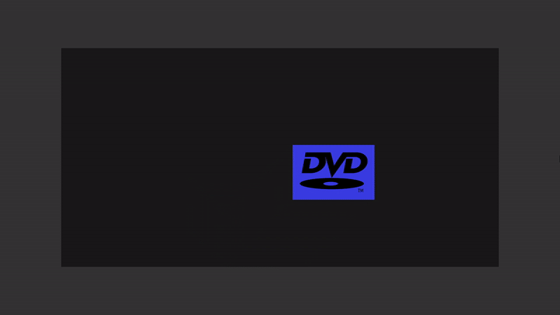

# Bouncing DVD Logo

The objective of this project is to recreate the bouncing DVD logo from the TV show, [The Office (U.S.)](https://www.nbc.com/the-office):

https://www.youtube.com/watch?v=QOtuX0jL85Y

# Demonstration



# Project Setup

1. Clone the repository to your local machine:

   ```
   git clone https://github.com/eddylu94/BouncingDvdLogo
   ```

2. Navigate into the cloned project directory:

   ```
   cd BouncingDvdLogo
   ```

3. Install all dependencies:

   ```
   npm install
   ```

4. Run the project:

   ```
   npm start
   ```

   The console should then print a statement with a URL in which the application is running.

   For example:

   > You application is running here: http://localhost:8080/

6. Launch the application in a web browser by navigating to the URL printed by the console
